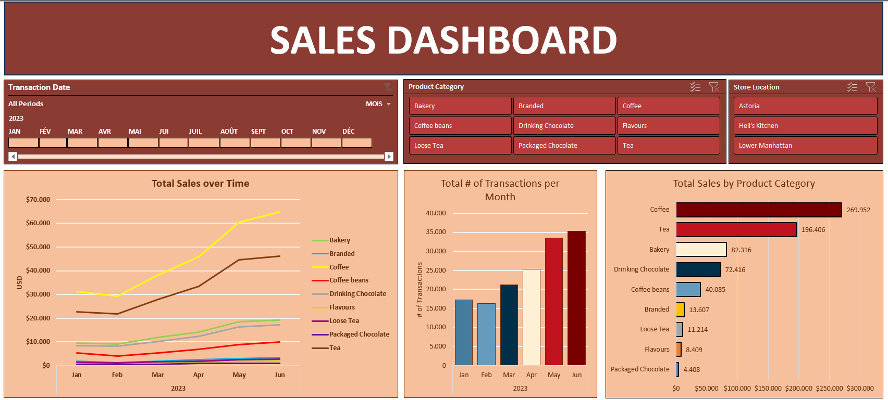

# Sales Dashboard Project

## Overview
This project involves the creation of a comprehensive sales dashboard using Microsoft Excel. The dashboard provides key insights into sales metrics, enabling stakeholders to make informed decisions based on visualized data.

## Features
- **Visual Representation of Sales Data:** The dashboard leverages charts and pivot tables to present sales data visually, allowing for easy identification of trends in total sales, product category performance, and sales by store location.
- **Dynamic Filtering:** Utilized Excel's filtering capabilities to enable users to explore the data by specific timeframes or product categories, fostering deeper analysis.
- **Interactive Dashboard:** The interactive nature of the dashboard allows users to gain insights into the total number of transactions per month, total sales by product category, and more.

## Screenshot

## Tools and Technologies
- **Microsoft Excel:** Used for creating the dashboard and implementing various visualizations.
- **Charts and Pivot Tables:** Employed to represent sales data visually.
- **Filtering Capabilities:** Enabled to facilitate deeper data analysis.

## How to Use
1. Open the Excel file containing the sales dashboard.
2. Use the filtering options to select specific timeframes, product categories, or store locations to analyze.
3. Explore the various charts and graphs to gain insights into the sales performance.

## Project Highlights
- **Constructed a sales dashboard in Microsoft Excel to effectively communicate key sales metrics to stakeholders.**
- **Leveraged charts and pivot tables to present sales data visually, allowing for easy identification of trends in total sales, product category performance, and sales by store location.**
- **Utilized Excel's filtering capabilities to enable users to explore the data by specific timeframes or product categories, fostering deeper analysis.**

## Contact
For any questions or further information, feel free to reach out.

---
